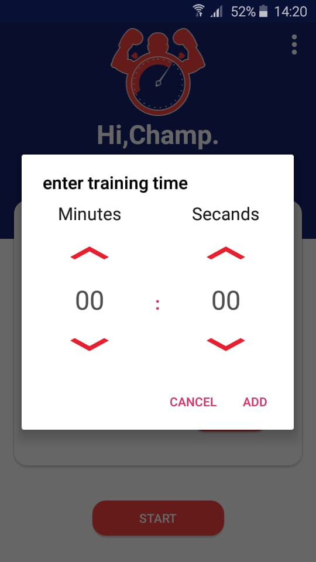

# TimerDialog_only_Minutes-Seconds
Custom Timer dialog that contains only minutes and seconds.

you can use the dialog by implemening the interface DialogEvent that contain three method (onPositiveDialogResult,onNegativeDialogResult,onDialogCancelled).

Also here is another method that it will help you for using this dialog in multiple places :

    private void onClickShowDialog(int dialog_id, String title) {

        AppclockTimer dialog = new AppclockTimer();
        Bundle args = new Bundle();
        args.putInt(AppclockTimer.DIALOG_ID, dialog_id);
        args.putString(AppclockTimer.Dialog_Message, title);
        args.putInt(AppclockTimer.DIALOG_POSITIVE_RID,R.string.add);

        dialog.setArguments(args);
        dialog.show(getSupportFragmentManager(), null);

    }
    
==> its better to give each dialog an ID so that it can appear with its own message and button.

and you can implement the method of the DialogEvent interface in this way :

    @Override
    public void onPositiveDialogResult(int dialogId, Bundle args) {
        Log.d(TAG, "onPositiveDialogResult: called");
        switch (dialogId){
            case DIALOG_FOR_TRAIN:
                //your code
                break;
            case DIALOG_FOR_BREAK:
                //your code
                break;
        }
    }
    
==> So as you can see am using switch statement, it helps a lot so that it can deal with each dialog as you want.

NOTE : IF YOU WANT TO PUT THE SELECTED VALUE FROM THE DIALOG INTO EDITTEXtT (just an example), you can do it like this :

    @Override
    public void onPositiveDialogResult(int dialogId, Bundle args) {
        Log.d(TAG, "onPositiveDialogResult: called");
        switch (dialogId){
            case DIALOG_FOR_TRAIN:
                String str = args.getString("minute")+" : "+args.getString("secands");
                training_Time = (EditText) findViewById(R.id.Main_trainTime);
                training_Time.setText(str);
                break;
            case DIALOG_FOR_BREAK:
                String str2 = args.getString("minute")+" : "+args.getString("secands");
                reset_Time = (EditText) findViewById(R.id.Main_resetTime);
                reset_Time.setText(str2);
                break;
        }
    }
    
    
    
